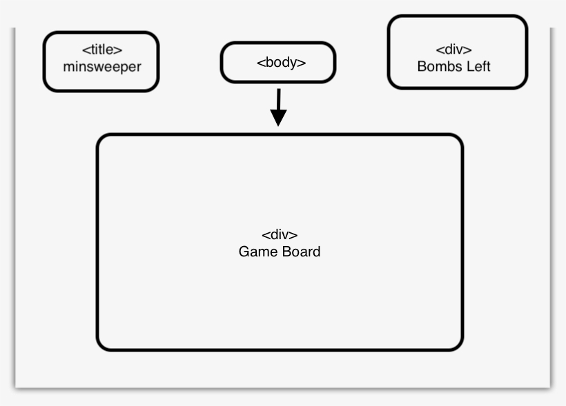

# Minesweeper
A remake of the classic puzzle game Minesweeper. Clear the mines and reveal the squares one at a time. 

Minesweeper is a single player puzzle game. The goal of the game is to clear the whole board containing hidden mines and bombs without detonating them. Each cell will help give a clue about the neighboring cells.

## Tech Being Used

HTML/CSS - Canvas to hold the game
JavaScript

## WireFrame

## MVP Checklist
* Render the starting board
* Render pieces to setup board
* Render each cell to contain a normal number square * or mine
* Render a win condition
* Have a start and end game finish screen

## Stretch Goals
* To create a random algorithm to change level setup 
* to create 3 different levels of difficulty
* Have a score to track number of squares revealed
* render a action to put a warning on suspected cell

#https://jaronw1.github.io/project11/
